# PortromOTAUpdater

PortromOTAUpdater is a simple application that allows you to display your Port ROM changelogs directly within the system settings and receive OTA updates just like an official ROM.

> **Note:**
> - This repository serves as the public documentation and showcase for the application. The source code is closed and proprietary.
> - Update packages must still be provided and maintained by the ROM developer.

In addition to OTA updates, the application also provides several extra features, such as Advanced Reboot options and Local install.

## Screenshots

  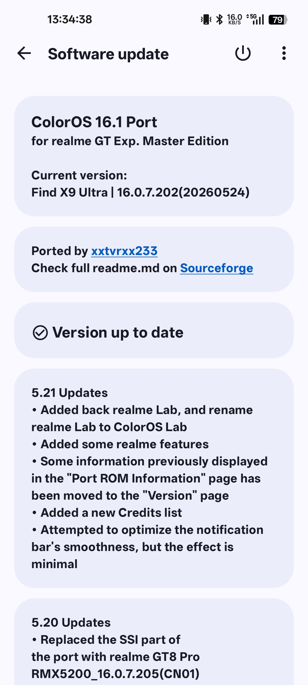
  &nbsp;&nbsp;&nbsp;
  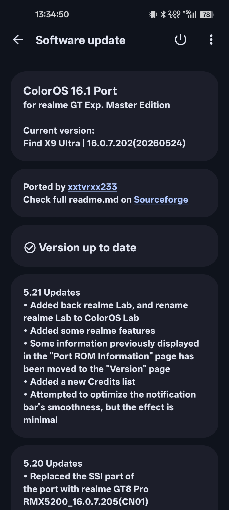
   
  Main Dashboard (Light & Dark Theme)

  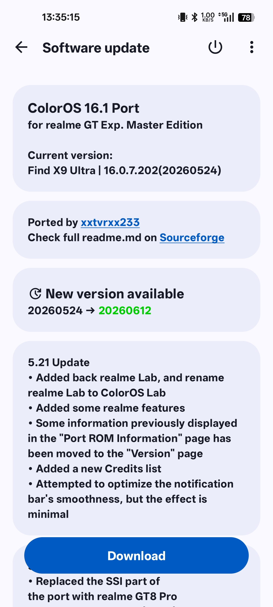
  &nbsp;&nbsp;&nbsp;
  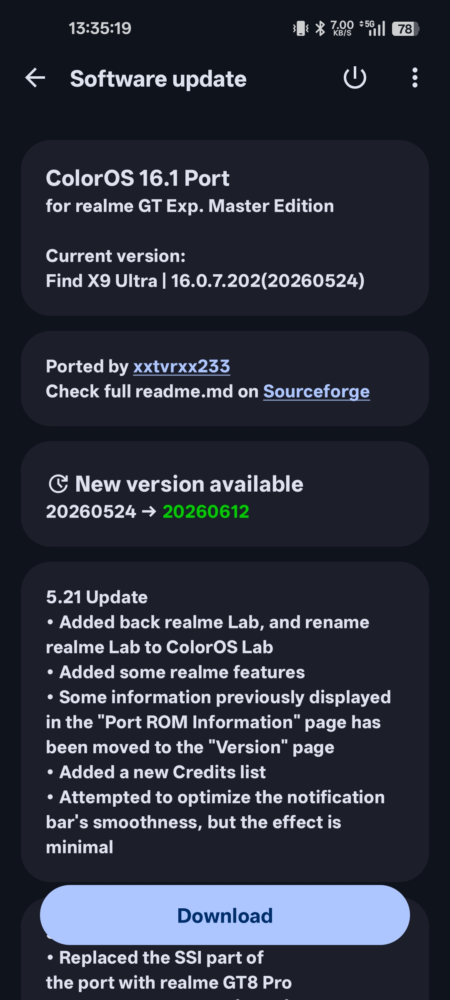
   
  Update Available Screen (Light & Dark Theme)

  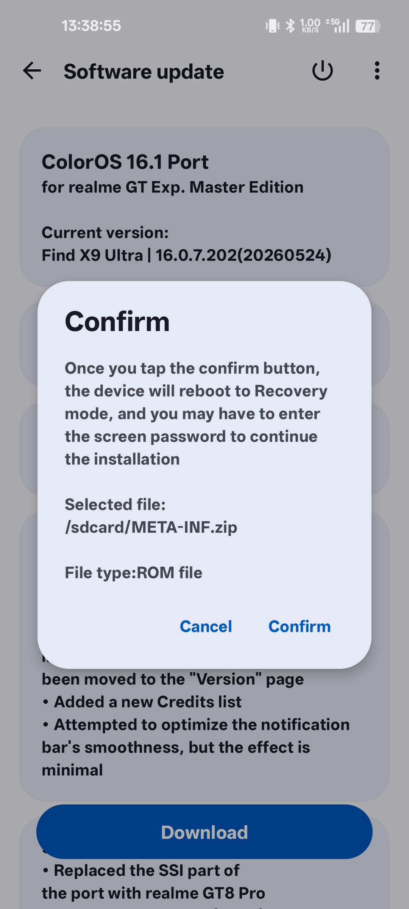
  &nbsp;&nbsp;&nbsp;
  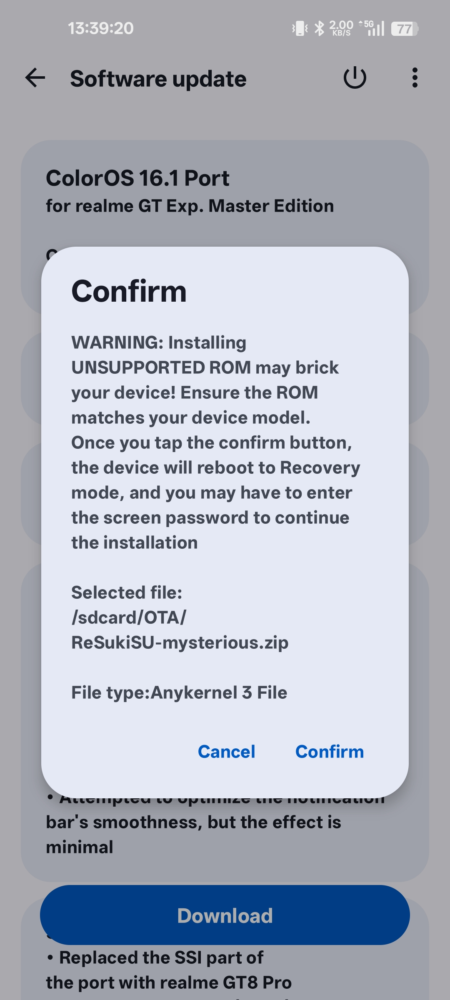
   
  Standard ROM & AnyKernel3 (AK3) Installation Confirmations

  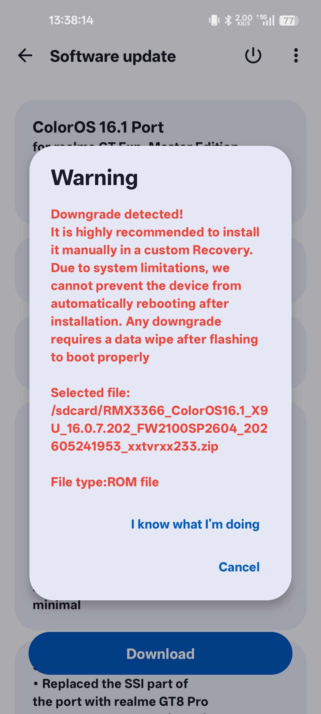
  &nbsp;&nbsp;&nbsp;
  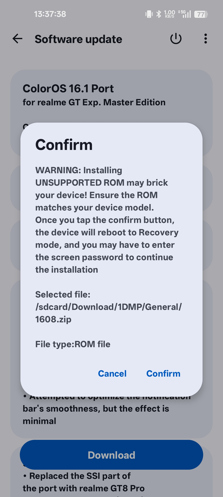
   
  Safety Alerts: Downgrade & Incompatible Package Warnings

  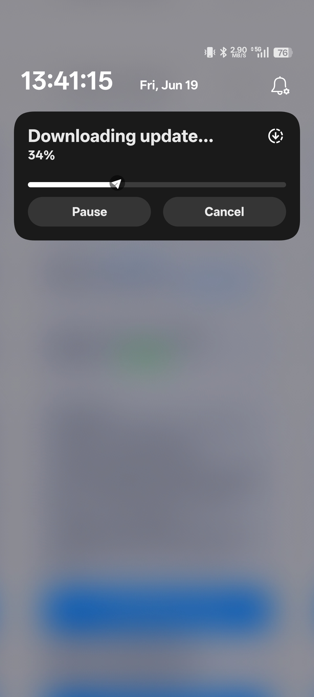
  &nbsp;&nbsp;&nbsp;
  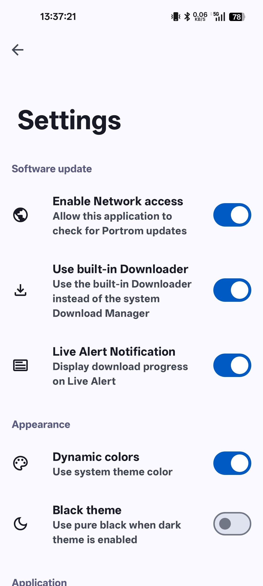
   
  Live Update Notification & Application Settings

  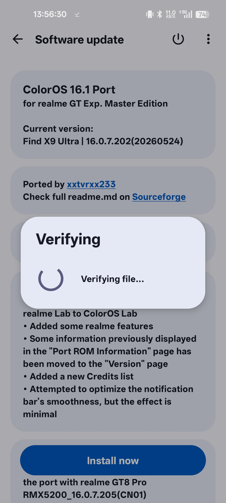
  &nbsp;&nbsp;&nbsp;
  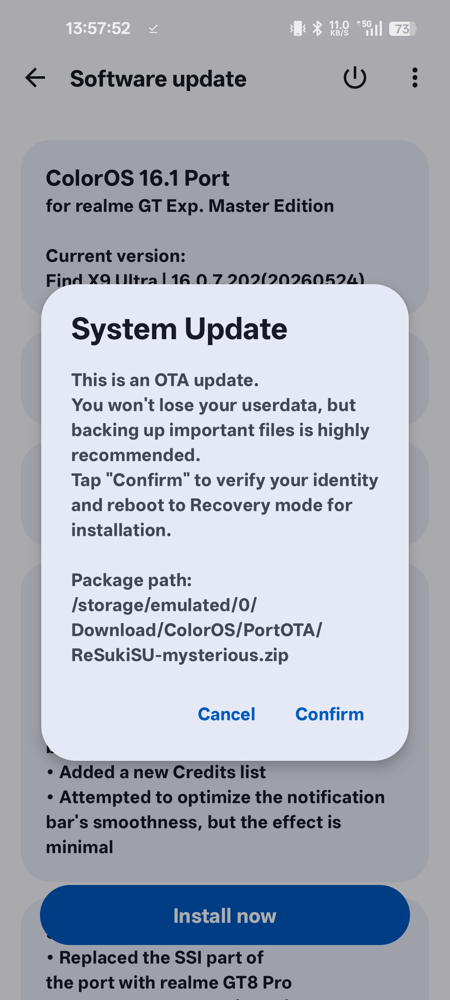
   
  Verity Verification & OTA Installation Confirmation

## About

This project was originally designed as a replacement for the built-in ColorOS Software Update application. 

However, it is not affiliated with ColorOS, Oplus, or the Oplus Team in any way, and contains no proprietary Oplus code.

Although this application was designed specifically for customized ROMs, it can be run on other ROMs with simple modifications. In theory, it can run on any modern Android-based system.

## System Integration

PortromOTAUpdater is implemented as a system application.

The package name `com.oplus.ota` is intentionally used so users can easily locate the update entry within system settings without introducing additional learning costs or requiring modifications to existing settings integrations.

The application also uses the Android system `("android")` shared UID, allowing it to operate with system-level permissions.

## Features

- Display Port ROM changelogs directly within system settings
- OTA update support similar to official ROMs
- Local ROM installation function without any restrictions
- Advanced Reboot options
- Built-in downloader based on LineageOS Updater
- Live Update notification support (built-in downloader only)
- Material Design 3 user interface with Monet Dynamic Color support

## Disclaimer

- This project is not affiliated with Oplus, OPPO, ColorOS, or the Oplus Team.
- No proprietary Oplus code is included in this project.
- The `"com.oplus.ota"` package name is used solely for compatibility and integration purposes.

## Contributors

| Contributor | Features |
|------------|----------|
| **[Natsu Yuki](https://github.com/rdhyf)** | Local/Remote changelog loading, EntryActivity layout, OTA update checking, Advanced Reboot |
| **xxtvrxx233** | Local ROM installation, Material Design 3 style ui design, OTA update installer, app Settings, Cards & Loading animations |

## License

PortromOTAUpdater is proprietary software and is not open source.

Copyright © 2026 Natsu Yuki and xxtvrxx233. All rights reserved.

### Third-Party Open Source Notices

This project includes components derived from third-party open-source projects. We gratefully acknowledge the following software used in this app:

* **Android Jetpack (androidx.*)**
    * License: [Apache License 2.0](http://www.apache.org/licenses/LICENSE-2.0)
    * Copyright © The Android Open Source Project
* **Material Components for Android (com.google.android.material.*)**
    * License: [Apache License 2.0](http://www.apache.org/licenses/LICENSE-2.0)
    * Copyright © Google LLC
* **Material Symbols (Google Fonts)**
    * License: [Apache License 2.0](http://www.apache.org/licenses/LICENSE-2.0)
    * Copyright © Google LLC
* **LineageOS Updater (org.lineageos.updater.download.*)**
    * License: [Apache License 2.0](http://www.apache.org/licenses/LICENSE-2.0)
    * Copyright © The LineageOS Project

Third-party licenses remain the property of their respective copyright holders and are provided in accordance with their original license terms.
